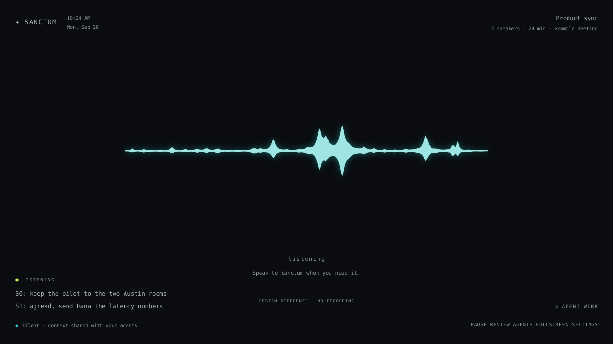

# Sanctum — AI meeting notes and shared agent memory

An open-source TypeScript + Effect project for silent meeting capture, source-linked memory, and shared context through MCP and SDKs.

[](https://github.com/undeemed/sanctum/actions/workflows/ci.yml)
[](LICENSE)
[](tasks/todo.md)

[Read the blueprint](https://i098.github.io/sanctum/) · [Preview the interface](https://i098.github.io/sanctum/design/listener-reference.html) · [Build handoff](HANDOFF.md) · [Contribute](CONTRIBUTING.md)

**Status: pre-implementation.**
This repository contains the product specification, architecture, 26-task build plan, independent visual references, and working documentation CI/CD.
The meeting recorder, model pipeline, integrations, SDKs, and MCP server are planned; they are not a released application yet.
No legacy application code, recordings, or production data are included.



The reference shows the intended interface, not a running recorder.
Its animated preview does not access your microphone.

## What Sanctum will do

Sanctum is designed to listen quietly while a team talks, preserve the source conversation, and keep useful context available to people and their agents.

- **Ambient meeting notes:** browser microphone capture with a fullscreen waveform; silent unless directly addressed.
- **Automatic meeting sessions:** detect boundaries and allow manual split, merge, and correction.
- **Complete source evidence:** full transcripts and private audio recordings in Cloudflare R2.
- **Selective, time-aware memory:** decisions, commitments, and project facts linked to speakers, timestamps, and source passages.
- **Shared agent context:** one versioned API for the website, TypeScript/Python SDKs, and a remote Model Context Protocol (MCP) server.
- **Controlled integrations:** Pipedream actions discovered on demand, with stored permissions and execution receipts.

Browser capture requires an open listener tab, an awake device, and microphone permission.
Server-side work can continue after the tab closes.
An installed desktop app is not required for the first version.

## Agent tools without context overload

The planned integration interface exposes three fixed tools:

1. `search_integration_actions` returns up to five short matches.
2. `get_integration_action` resolves only the selected action's inputs and configuration.
3. `request_action` checks authorization and queues work with an idempotency key.

The full Pipedream catalog stays server-side.
Tool discovery does not grant permission to execute an action.
See [the implementation contract](tasks/plan.md) for scopes, source provenance, concurrent writes, and failure handling.

## Start building

Give your coding agent this instruction:

> Read AGENTS.md and HANDOFF.md, then implement tasks/plan.md using tasks/todo.md. Build from scratch; do not import the old application. Match docs/DESIGN.md and design/listener-reference.html closely. Complete reversible implementation and local validation, and report unresolved live-deployment requirements separately.

| Document | Purpose |
| --- | --- |
| [HANDOFF.md](HANDOFF.md) | The execution brief for one integrated implementation run. |
| [Implementation plan](tasks/plan.md) | Architecture, storage, APIs, MCP, SDKs, auth, recovery, and deployment. |
| [26-task checklist](tasks/todo.md) | Ordered work with acceptance criteria and verification. |
| [Design contract](docs/DESIGN.md) | Layout, colors, waveform shape, motion, and accessibility. |
| [Decisions](docs/DECISIONS.md) | Confirmed scope and remaining sign-in/recording policies. |
| [EXECUTE.txt](EXECUTE.txt) | Combined handoff, plan, and checklist. |

## Planned technology stack

| Layer | Choice |
| --- | --- |
| Website | React, TypeScript, Vite, Tailwind CSS, Canvas, Web Audio |
| Live audio | AudioWorklet + authenticated WebSocket PCM ingest |
| API and workers | Node.js 24 LTS, TypeScript, stable Effect v3 |
| Contracts and SQL | Effect Schema, HttpApi, `@effect/sql-mysql2` |
| Structured storage | MySQL 8.4 LTS / InnoDB |
| Recording storage | Cloudflare R2 |
| Agent interfaces | Official TypeScript MCP SDK; Promise-based TypeScript and thin Python clients |
| Integrations | Pipedream Connect |

One Node.js image runs separate API and worker processes; MySQL stores durable jobs.
Python is only a client SDK option, not a server dependency.
Performance target: optimized TypeScript with workload-specific Rust comparisons; no parity result is claimed before implementation and measurement.
Model and speaker-attribution choices remain evaluation-gated; provider claims are not application benchmarks.
The full selection is in [plan section 04](tasks/plan.md#04-chosen-technology-stack-and-runtime).

## Run the documentation locally

Requires Node.js 24.12+; CI uses Node.js 24 LTS.

```bash
git clone https://github.com/i098/sanctum.git
cd sanctum
npm ci
npm run check
npm run docs:build
```

Open `_site/index.html` in a browser, or use the [published documentation](https://i098.github.io/sanctum/).
After source edits, run `npm run docs:render` before checking and committing generated files.
These commands validate and assemble documentation, not the future meeting application.
Markdown and visual references work offline; enhanced diagram and code rendering load CDN assets.

## CI/CD

Pull requests and pushes validate the handoff, relative links, SVG/JSON references, JavaScript syntax, and generated-file consistency.
Successful pushes to `main` publish the documentation to [GitHub Pages](https://i098.github.io/sanctum/).
Fallow blocks new code findings; Sentrux blocks structural regressions against the committed floor and base revision.
Conventional Commit headers and PR titles are checked with a 72-character limit.
Publication waits for all checks.
Pull requests cannot deploy and receive no production secrets.
See [CI/CD details](docs/CI.md) for the exact checks and how to extend them when application code is added.

## Contributing

Contributions to requirements, API design, accessibility, evaluation fixtures, and implementation are welcome.
Read [CONTRIBUTING.md](CONTRIBUTING.md) before starting a change.
Use synthetic meeting content in public issues and tests; never upload private recordings or credentials.
Report security issues through the process in [SECURITY.md](SECURITY.md).

## License

[MIT](LICENSE).
Third-party services and referenced projects retain their own terms and licenses.
